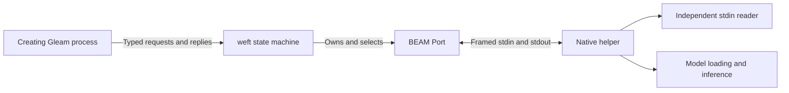
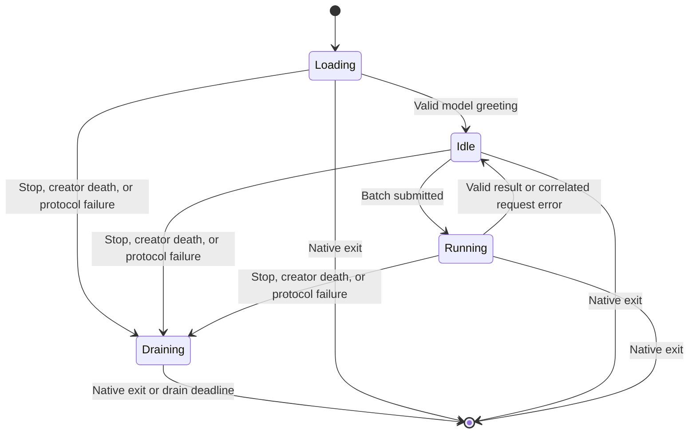

# Spindle architecture

Spindle keeps a local embedding model in a dedicated native process and
exposes it through a process-owned Gleam API. We use this boundary to keep
model memory, native crashes, and inference threads outside the BEAM VM.
The helper stays loaded across requests; callers explicitly create a new
engine after a timeout or terminal failure.

This document describes the current CPU implementation. Model profiles,
artifact verification, GPU execution, and release packaging remain open.
The [implementation plan](next.md) records those limits, and
[Loom issue #226](https://github.com/Roasbeef/loom/issues/226) tracks the
consumer's SQLite indexing and retrieval work.

## Process ownership

The process that calls `spindle.start` owns the resulting engine. Public
calls check that process identity before sending work. A synchronous call
admits one batch at a time, so sharing an engine across processes cannot
create an unbounded request queue. An engine is an opaque handle to its
machine and immutable startup metadata.

The machine monitors the creator and owns the Port directly. It selects
its typed command subject, messages from that Port, and the creator's
monitor. The Erlang shim opens an executable directly without a shell,
keeps stderr separate from protocol stdout, and sends without suspending
on a busy Port buffer. FFI exposes these runtime operations; Gleam owns
the policy.

A state machine already returns the same `Started` type used by Gleam OTP
actors and communicates through typed subjects. Spindle needs no extra
actor to translate messages or own the helper. The implementation uses
weft 0.4.2 without an upstream extension.

## Lifecycle

The phase type carries the information valid at each point in the
helper's lifetime. Transport data holds the Port, native PID, partial
frame, and next request ID separately. Receiving another fragment does
not constitute a lifecycle transition.

| Phase | Owned information | Permitted progress |
|---|---|---|
| `Loading` | No model or batch. | Accept the startup greeting; postpone the startup call. |
| `Idle` | Validated model bounds. | Answer startup or admit one batch. |
| `Running` | Model and one request's ID, operation, count, and reply subject. | Validate the matching response, then return to `Idle`. |
| `Draining` | First teardown reason and optional stop acknowledgement recipient. | Observe native exit or report an expired drain wait. |

Startup uses weft's postponed-event support. If `Ready` arrives while the
model loads, the machine postpones that command. A transition to `Idle`
replays it with validated metadata. A transition to `Draining` replays it
with the original teardown reason. A later stop preserves that reason.
There is no separate startup-waiter field to preserve on
every failure path.

`Running` always contains a loaded model and a request. The old actor
representation stored optional model data, optional pending work, and a
separate closing flag. The phase type removes combinations such as a
running request without model bounds. A duplicate greeting after startup
is a protocol failure, not a replacement for the model metadata.

Entering `Draining` settles any running request before retaining the stop
recipient. Native stdout received afterward cannot complete work or
replace that recipient. Once this phase begins, no transition admits a
new request or returns to `Idle`.

## Deadlines and native exit

The public call waits for its requested deadline, subject to the API's
1 to 300,000 millisecond bound. Model startup also has a separate
one-second machine-initialization bound for opening the Port; model
loading happens afterward. A timed-out call sends `Stop` and allows five
additional seconds for its acknowledgement.

The first entry into `Draining` sends native shutdown and starts a
five-second weft named timeout. A named timeout matters here: replacing
the acknowledgement subject changes the `Draining` value, which weft
would treat as a state change. The named deadline survives that update
and is armed only once. Repeated stops and late stdout cannot extend it.

The native reader starts before model loading. It reads independently of
inference and terminates the entire process on shutdown or stdin EOF.
Shutdown bypasses the one-frame work slot, so it does not wait behind an
embedding batch. The OS reclaims the process's model memory and threads.

The machine reports successful stop only after receiving the Port's
native exit status of zero. A nonzero status is a helper failure. If the
drain deadline fires first, it reports `DrainUnconfirmed`, closes the
Port, and stops. Closing the Port requests EOF teardown; it does not
prove that the native process has exited.

Killing the machine closes its owned Port even though no shutdown
callback runs. The helper's reader then sees EOF. This ownership rule
replaces the actor's explicit `on_shutdown` close callback. A caller that
observes machine death receives `Unavailable`, which makes no claim
about native drain.

| Result | What the caller knows |
|---|---|
| Successful `stop` | Native exit with status zero was observed. |
| `TimedOut` | The operation deadline expired and native exit with status zero was subsequently observed. |
| `HelperFailed` | Startup, request validation, inference, or shutdown failed; the error category alone does not establish drain. |
| `DrainUnconfirmed` | Teardown was requested, but native exit was not confirmed to this call. |
| `Unavailable` | The machine is unavailable; native drain is not established. |

The machine settles a running request before acknowledging stop. Since
both messages come from the same process, a confirmed acknowledgement
lets the caller consume the timed-out request's queued terminal reply.
An unconfirmed teardown can still leave late replies in a long-lived
creator mailbox. Disposable reply delivery remains follow-up work; the
state-machine conversion does not claim to solve it.

## Protocol and model execution

[`protocol.gleam`](../src/spindle/protocol.gleam) contains the pure wire
codec. [`protocol.md`](protocol.md) specifies the exact tags and limits.
A four-byte big-endian length precedes each bounded payload. Gleam checks
accumulated frame size before concatenation; native code checks the
header before allocating its body. Diagnostics never enter stdout.

The native reader transfers at most one pending frame to the inference
thread. The public API does not pipeline requests. Native code validates
all inputs before inference and builds the full response before sending
it, so a later input error cannot publish a partial embedding batch.

Token counting and embedding share tokenizer settings. Inputs exceeding
the 2,048-token context fail explicitly. The current helper loads one
model with CPU execution, four threads, and model-selected mean, CLS, or
last-token pooling. It rejects nonfinite and zero-norm output before
normalization. Gleam independently validates vector shape, finite float
encoding, and unit norm against the in-flight request and loaded model.

The observed dimensions identify a shape, not an embedding space. The
current `query` and `document` helpers format EmbeddingGemma inputs;
they do not verify that the supplied model is EmbeddingGemma. A future
profile must pin the artifact, tokenizer, templates, pooling, and output
conventions before Loom can safely persist compatible vectors.

## Verification and remaining boundaries

The deterministic suite covers protocol framing, shape validation,
creator ownership, postponed startup, timeout acknowledgement races,
late malformed stdout during drain, machine hard kill, and a peer that
ignores shutdown, including repeated stops against the original deadline. The real-model executable verifies embeddings,
repeatability, stop, reload, and EOF cleanup after killing the machine
with a loaded model. Native tests cover malformed requests, input limits,
and shutdown delivery around startup and batch submission.

These tests do not establish interruption at a controlled point inside
model execution or cleanup while the kernel itself blocks native work.
Linux and macOS CI run the deterministic suite and compile the native
helper; real-model execution remains an explicit local command using
separately supplied weights. No result here establishes retrieval
quality. Loom owns source extraction, chunking, index transactions,
erasure, and ranking, independently of Spindle's helper lifecycle.
